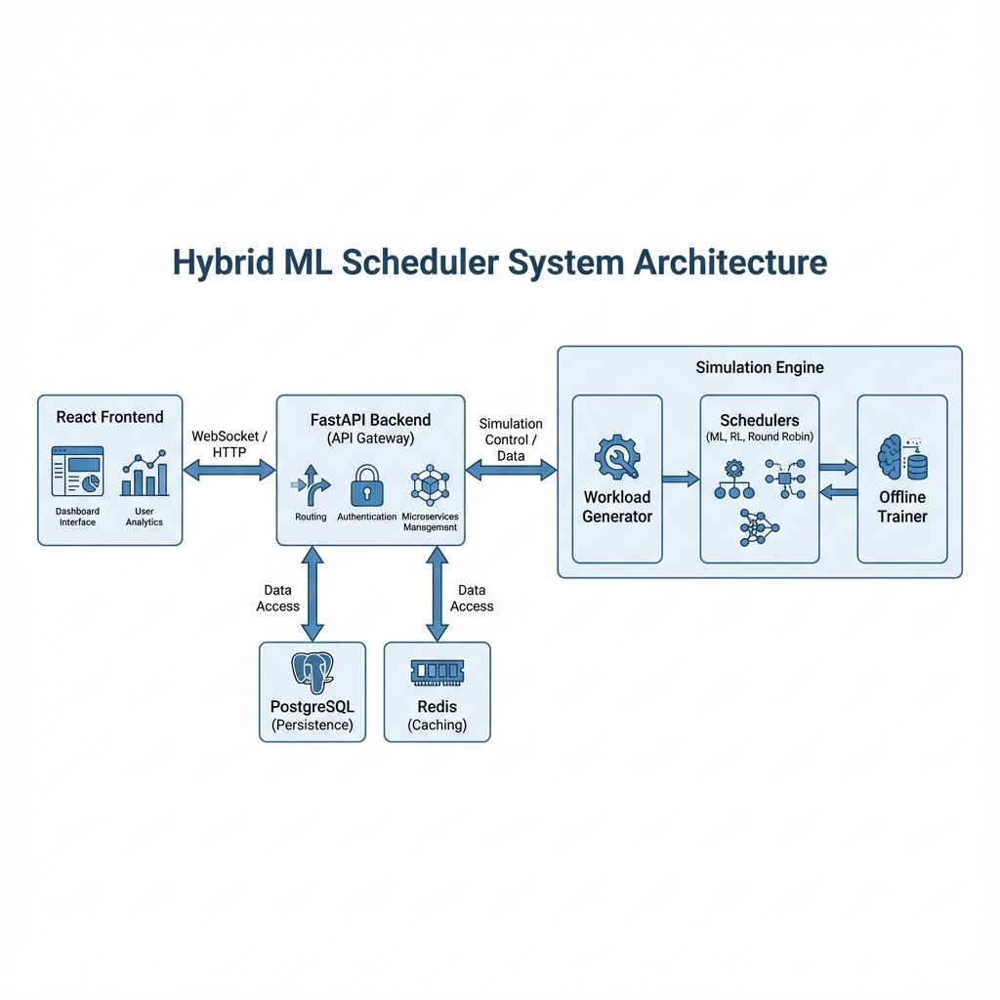

# Hybrid ML Scheduler - Project Documentation

**Version:** 2.0.0
**Date:** November 27, 2025

---

## 1. Executive Summary

The **Hybrid ML Scheduler** is an advanced simulation and scheduling system designed to optimize task allocation in heterogeneous computing environments (CPU + GPU). It leverages **Machine Learning (Random Forest)** and **Reinforcement Learning (DQN)** to make intelligent scheduling decisions that balance execution time, energy consumption, and cost.

The system features a continuous simulation engine, a robust backend API, persistent storage, and a real-time interactive dashboard for visualization and analysis.

---

## 2. System Architecture (High-Level Design)

The system follows a modern, modular architecture composed of four main layers:

1.  **Presentation Layer (Frontend):** A React-based dashboard for real-time monitoring and control.
2.  **Application Layer (Backend):** A FastAPI server handling API requests, WebSocket streaming, and business logic.
3.  **Simulation Layer (Engine):** A Python-based engine that generates workloads and executes scheduling strategies.
4.  **Data Layer (Persistence):** PostgreSQL for long-term storage and Redis for high-speed caching.



### Data Flow Overview
1.  **Workload Generation:** The Simulation Engine generates synthetic tasks with varying characteristics (size, compute intensity, memory).
2.  **Scheduling:** Tasks are processed by multiple schedulers in parallel (Round Robin, Random, Greedy, Hybrid ML, RL Agent, Oracle).
3.  **Execution Simulation:** A Virtual Cluster model estimates execution time and energy based on the scheduling decision.
4.  **Data Persistence:** Results are saved to PostgreSQL via the Backend API. Training data is buffered and stored.
5.  **Model Retraining:** The Offline Trainer periodically retrains the ML model using the latest historical data from the database.
6.  **Visualization:** The Backend broadcasts real-time updates via WebSockets to the Frontend Dashboard.

---

## 3. Deep Dive: Core Logic & Algorithms

This section explains the internal mechanics of the system, allowing you to understand the "how" and "why" without reading the code.

### 3.1. Workload Generation (The "Tasks")
The system generates a continuous stream of synthetic tasks that mimic real-world parallel computing jobs.

*   **Generation Process:** Tasks arrive according to a **Poisson Process** (exponentially distributed inter-arrival times), creating a realistic, bursty workload.
*   **Task Attributes:**
    *   **Size ($N$):** The magnitude of the problem (100 - 5000 units).
    *   **Compute Intensity ($I$):** A value between 0.0 and 1.0 indicating how much the task benefits from parallelization.
        *   $I \approx 1.0$: Highly parallelizable (Matrix Multiplication, Deep Learning).
        *   $I \approx 0.0$: Serial (I/O bound, recursive logic).
    *   **Memory Required ($M$):** RAM usage (10 - 500 MB).
*   **Duration Model:** The estimated base duration is calculated as:
    $$ T_{base} \propto \frac{N^{1.5}}{I + 0.5} $$
    *This means larger tasks take super-linearly longer, but high compute intensity reduces time (assuming parallel hardware).*

### 3.2. The Schedulers (The "Competitors")
The system runs six scheduling strategies in parallel for every task to compare their performance.

#### 1. Round Robin (Baseline)
*   **Logic:** Alternates blindly between resources.
*   **Behavior:** Task $i$ goes to GPU, Task $i+1$ goes to CPU.
*   **Pros/Cons:** Simple but inefficient; sends GPU-hostile tasks to GPU and vice versa.

#### 2. Random (Baseline)
*   **Logic:** Assigns a random fraction of the task to the GPU ($0.0$ to $1.0$).
*   **Pros/Cons:** Acts as a stochastic baseline to prove that other methods are learning.

#### 3. Greedy (Heuristic)
*   **Logic:** Uses the task's **Compute Intensity** directly as the GPU fraction.
*   **Formula:** $Fraction_{GPU} = Intensity$
*   **Rationale:** High intensity tasks *should* go to GPU. This is a strong heuristic baseline.

#### 4. Hybrid ML (The "Brain")
*   **Type:** Supervised Learning (Random Forest Regressor).
*   **Features:**
    *   Raw: `Size`, `Intensity`, `Memory`.
    *   Derived: `Memory per Unit Size`, `Compute to Memory Ratio`.
*   **Logic:**
    1.  Predicts the **Optimal GPU Fraction** ($y$) that minimizes execution time.
    2.  Selects the specific GPU ID that minimizes a weighted cost of **Time** and **Energy**.
*   **Training:** Retrains every 50 tasks using a sliding window of the last 1000 "Oracle" decisions.

#### 5. RL Agent (Deep Q-Network)
*   **Type:** Reinforcement Learning (DQN with Dueling Architecture).
*   **State:** Vector $[Size, Intensity, Memory]$.
*   **Action Space:** Discrete choices: $\{CPU, GPU_0, GPU_1, GPU_2, GPU_3\}$.
*   **Reward Function:** Negative weighted sum of Time and Energy.
    $$ R = - (0.5 \times Time + 0.5 \times Energy) $$
*   **Learning:** Uses "Experience Replay" to learn from past mistakes and optimizes its policy to maximize long-term rewards.

#### 6. Oracle (The "Ground Truth")
*   **Logic:** A theoretical solver that "cheats" by trying every possible split (0% to 100% in 5% steps).
*   **Purpose:** It finds the absolute mathematical minimum execution time for a task.
*   **Usage:**
    *   Acts as the **Label** for the Hybrid ML model (Supervised Learning).
    *   Serves as the **Performance Ceiling** (100% Efficiency) for comparison.

### 3.3. Simulation Physics
How do we calculate "Time" and "Energy"?

*   **Execution Time:**
    *   **CPU Time:** Base duration.
    *   **GPU Time:** $\frac{Base Duration}{Speedup} + TransferTime$
    *   **Speedup:** $1.0 + (3.0 \times Intensity)$ (Max 4x speedup for high intensity).
    *   **Transfer Time:** $\frac{Memory}{Bandwidth}$ (Simulating PCIe bottlenecks).
*   **Energy Consumption:**
    *   **GPU Power:** 50W (Active).
    *   **CPU Power:** 30W (Active).
    *   $Energy (Joules) = Power \times Time$.

---

## 4. System Flow & Architecture

### 4.1. The "Loop"
1.  **Generate:** A new task is born (`WorkloadGenerator`).
2.  **Broadcast:** The task is sent to all 6 schedulers simultaneously.
3.  **Decide:** Each scheduler makes its move (Predict, Randomize, or Calculate).
4.  **Simulate:** The `VirtualMultiGPU` calculates the *result* (Time, Energy) for each decision.
5.  **Persist:** Results are saved to PostgreSQL.
6.  **Learn:**
    *   **Hybrid ML:** If 50 tasks have passed, fetch history -> Retrain Random Forest.
    *   **RL Agent:** Store transition -> Update Q-Network weights.
7.  **Visualize:** Send JSON packet via WebSocket to the Dashboard.

### 4.2. Component Details

#### Frontend Dashboard (`/dashboard`)
*   **Tech:** React, Vite, TailwindCSS, Recharts.
*   **Key Views:**
    *   **Performance Race:** A live bar chart where shorter bars = faster schedulers.
    *   **Enhanced Analytics:**
        *   **Heatmap:** Shows which tasks (Size vs. Intensity) perform best on GPU.
        *   **Win/Loss Matrix:** How often Scheduler A beats Scheduler B.
        *   **State Management**: Uses React `useState` and `useEffect` for real-time data updates.


#### Backend Server (`/backend`)
*   **Tech:** FastAPI, Uvicorn, SQLAlchemy (Async), Pydantic.
*   **Role:** The central nervous system. It orchestrates the simulation, manages the DB connection, and serves the API.
*   **Security:** Implements Rate Limiting (Redis) and Input Validation to protect the system.

#### Data Layer
*   **PostgreSQL:** Stores the "Truth". Every single task execution is logged here.
*   **Redis:** The "Short-term Memory". Caches high-speed data like current stats to prevent DB overload.

## 5. Technical Reference

### 5.1. Database Schema (PostgreSQL)
The system uses a relational schema optimized for time-series performance.

#### `tasks` Table
Stores metadata for every generated task.
| Column | Type | Description |
|--------|------|-------------|
| `task_id` | Integer (PK) | Unique identifier for the task. |
| `size` | Float | Problem size ($N$). |
| `compute_intensity` | Float | Parallelizability factor ($0.0 - 1.0$). |
| `memory_required` | Float | RAM required in MB. |
| `arrival_time` | Float | Simulation timestamp of arrival. |
| `dependencies` | JSONB | List of parent task IDs. |

#### `scheduler_results` Table
Logs the outcome of every scheduling decision.
| Column | Type | Description |
|--------|------|-------------|
| `id` | Integer (PK) | Unique result ID. |
| `task_id` | Integer (FK) | Reference to the task. |
| `scheduler_name` | String | Name of the strategy (e.g., 'hybrid_ml'). |
| `gpu_fraction` | Float | Allocated GPU portion ($0.0 - 1.0$). |
| `actual_time` | Float | Execution time in seconds. |
| `energy_consumption` | Float | Energy used in Joules. |
| `execution_cost` | Float | Cost in USD. |

#### `training_data` Table
Historical data used to train the Hybrid ML model.
| Column | Type | Description |
|--------|------|-------------|
| `size` | Float | Task size. |
| `compute_intensity` | Float | Task intensity. |
| `optimal_gpu_fraction` | Float | **Label:** The best fraction found by Oracle. |
| `optimal_time` | Float | The execution time achieved by Oracle. |

### 5.2. API Specification (FastAPI)

#### Simulation Control
*   `POST /api/simulation/start`: Begin the continuous simulation.
*   `POST /api/simulation/stop`: Gracefully stop the engine.
*   `POST /api/simulation/pause`: Temporarily halt task generation.
*   `GET /api/simulation/status`: Get current stats (tasks processed, running state).

#### Data & Metrics
*   `GET /api/full_history`: Retrieve the latest 1000 training records (used for charts).
*   `GET /api/metrics`: Expose Prometheus-formatted metrics for scraping.
*   `GET /api/health`: Check connectivity to PostgreSQL and Redis.

#### WebSocket (`/ws`)
*   **Protocol:** JSON over WebSocket.
*   **Events:**
    *   `simulation_update`: Real-time packet with current task, scheduler results, and cluster utilization.
    *   `notification`: System alerts (e.g., "Model Retrained").

### 5.3. Configuration Management
The system is configured via environment variables (using `pydantic-settings`).

#### Key Variables (`.env`)
| Variable | Default | Description |
|----------|---------|-------------|
| `ENVIRONMENT` | development | App environment (dev/prod). |
| `POSTGRES_HOST` | localhost | Database host. |
| `POSTGRES_DB` | hybrid_scheduler_db | Database name. |
| `REDIS_HOST` | localhost | Redis cache host. |
| `NUM_GPUS` | 4 | Number of virtual GPUs to simulate. |
| `RETRAIN_INTERVAL` | 50 | Tasks between model updates. |

---

## 6. Directory Structure
```
hybrid_ml_scheduler/
├── backend/                # FastAPI Application
│   ├── api/                # Routes and Controllers
│   ├── core/               # Config and DB setup
│   ├── middleware/         # Rate Limit, Security
│   ├── models/             # SQLAlchemy & Pydantic models
│   └── services/           # Business Logic (Data, Cache)
├── dashboard/              # React Frontend
│   ├── src/
│   │   ├── components/     # Reusable UI widgets (Charts)
│   │   └── App.jsx         # Main Dashboard View
├── src/                    # Simulation Engine
│   ├── simulation_engine.py # Main Loop
│   ├── online_scheduler.py  # Hybrid ML Logic
│   ├── dqn_scheduler.py     # RL Logic
│   └── workload_generator.py # Task Factory
├── scripts/                # Utility Scripts (Init DB, Verify)
└── tests/                  # Unit and Integration Tests
```

---

