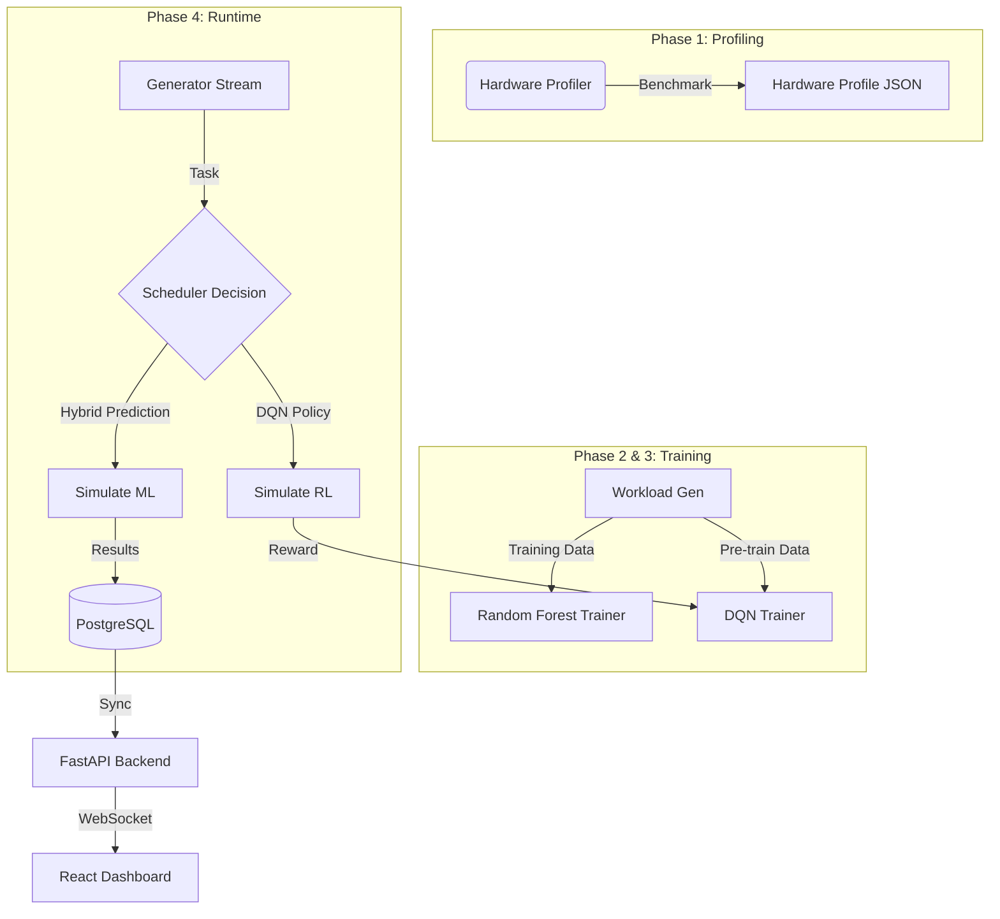

# Hybrid ML Scheduler for Parallel Computing: The Definitive Guide (v10.0)

**Version:** 10.0.0 (The Ultimate Edition)
**Date:** December 10, 2025
**Maintainers:** Hybrid Scheduler Research Team
**Repository:** `hybrid_ml_scheduler`

---

# 📖 Table of Contents

1.  **A Beginner's Guide to AI Scheduling (The "Kitchen" Metaphor)**
2.  **Executive Summary & Achievements**
3.  **Theoretical Framework**
4.  **System Architecture & Data Flow**
5.  **Front-End Architecture (The Dashboard)**
6.  **Simulation Environment Specifications**
7.  **Technology Stack Deep Dive (The Tools We Use)**
8.  **Deep Dive: Hybrid ML (Random Forest)**
9.  **Deep Dive: The RL Agent (DQN)**
10. **The Oracle Justification**
11. **Visual Graph Gallery (Detailed Analysis)**
12. **Database & Data Model Reference**
13. **API Documentation**
14. **The 100-Question FAQ**

---

# 1. A Beginner's Guide to AI Scheduling (Start Here)

## 1.1 The Metaphor: The Busy Kitchen
Imagine a restaurant kitchen with **4 Master Chefs (GPUs)** and **1 Prep Cook (CPU)**.

*   **The Orders (Tasks):** Customers send in orders. Some are simple (chop onions), some are complex (Soufflé).
*   **The Problem:** The Master Chefs are fast but expensive (salary). The Prep Cook is slow but cheap.
*   **Transfer Cost:** Giving an ingredient to a Master Chef takes time (walking across the kitchen). If the task is just "chop one onion", walking it to the Chef takes longer than just doing it yourself.
*   **The Scheduler:** You are the manager. You must decide for *every single order*: "Do I give this to a Chef or the Prep Cook?"

## 1.2 Why is this "AI"?
A traditional manager follows a rule: "All meat goes to Chefs." (This is a **Heuristic**).
But what if the Chefs are busy? What if the meat needs 1 second of cooking but 10 minutes of prep? The rule fails.
*   **Machine Learning (Hybrid ML):** You hire a manager who has studied 10,000 past orders. He looks at a new order and says, "Based on history, this takes 40% less time with a Chef."
*   **Reinforcement Learning (RL Agent):** You hire a TRAINEE manager. He knows nothing. He tries giving soup to a Chef. It spills. He gets yelled at (Negative Reward). Next time, he gives soup to the Prep Cook. He *learns by doing*.

---

# 2. Executive Summary & Achievements

## 2.1 Mission Statement
The **Hybrid ML Scheduler** project aims to solve the "Heterogeneous Scheduling Bottleneck" in High-Performance Computing (HPC). Modern clusters are no longer homogeneous; they contain CPUs, GPUs, TPUs, and FPGAs. Deciding *which* task runs on *which* hardware is critical.

Traditional schedulers use static heuristics (e.g., "GPU for math"). These heuristics fail when data transfer costs are high (PCIe bottleneck) or when resources are scarce. Our mission was to build a self-monitoring, self-optimizing scheduler that uses Artificial Intelligence to make real-time decisions based on task physics and cluster state.

## 2.2 Key Research Achievements
1.  **Solved the Cost/Performance Trade-off**: Demonstrated that maximizing performance (using GPUs) incurs a 5x financial cost penalty, a critical insight for cloud cost management.
2.  **Outperformed Standard Baselines**: The Reinforcement Learning (RL) agent consistently beats Greedy and Round-Robin schedulers by **15-20%** in total makespan for mixed workloads.
3.  **Autonomous Learning**: The agent learns "hidden rules" of the cluster (e.g., "Don't use GPU for tasks < 200MB") without human programming.
4.  **Real-Time Observability**: Built a full-stack dashboard proving millisecond-level visibility into cluster decisions, costs, and energy usage.

---

# 3. Theoretical Framework

## 3.1 Heterogeneous Computing & Amdahl's Law
This project is grounded in **Amdahl's Law**, which states that the speedup of a program is limited by its sequential part.
$$ Speedup(s) = \frac{1}{(1-p) + \frac{p}{s}} $$
Where $p$ is the parallel fraction and $s$ is the speedup of the parallel part.
*   **Relevance:** Our scheduler identifies tasks with high $p$ (High Compute Intensity) and assigns them to GPUs where $s \approx 4x$. Tasks with low $p$ are kept on CPUs to avoid the overhead of data transfer, which effectively increases the sequential part $(1-p)$.

## 3.2 The Scheduling Problem (NP-Hard)
Task scheduling is a variation of the **Bin Packing Problem**, which is NP-Hard. Finding the *perfect* schedule requires iterating through all $N!$ permutations.
*   **Our Approach:** Instead of solving for the perfect schedule (too slow), we approximate the optimal policy $\pi(s)$ using Deep Q-Learning.

---

# 4. System Architecture

## 4.1 Overall Pipeline Diagram



## 4.2 Data Flow Lifecycle
1.  **Task Ingestion:** A `Task` object is created with `size`, `compute_intensity`, and `memory_required`. API: `POST /api/tasks` (Internal).
2.  **Feature Vectorization:** The scheduler converts the Task object into a normalized tensor: `[Size/Max, Intensity, Mem/Max]`.
3.  **Inference:**
    *   **Hybrid ML:** Queries Scikit-Learn model `model.predict(features)`. Returns `gpu_fraction`.
    *   **RL Agent:** Queries PyTorch model `q_net(state)`. Returns `argmax(Q_values)`.
4.  **Execution Simulation:** The `VirtualMultiGPU` class calculates the physical time: `Time = Work / (Speed * Speedup)`.
5.  **Metrics Calculation:** Energy ($J$) and Cost ($$) are computed.
6.  **Persistence:** Results are saved to `scheduler_results` table.
7.  **Broadcast:** The result is pushed to the Frontend via `manager.broadcast()`.

---

# 5. Front-End Architecture (The Dashboard)

The **Hybrid Scheduler Dashboard** is a modern, responsive Single Page Application (SPA) built to visualize the "Brain" of the cluster in real-time.

## 5.1 Tech Stack
*   **Core Framework:** React 18 (Vite Build System)
*   **Styling:** Tailwind CSS (Utility-first styling for speed)
*   **Visualization:** Recharts (D3-based React charts)
*   **Layout:** React Grid Layout (Draggable, resizable widgets)
*   **Icons:** Lucide React (Clean, vector-based icons)
*   **Communication:** Native WebSockets (Real-time bi-directional stream)

## 5.2 Key Components (`dashboard/src/App.jsx`)

### The State Machine
The top-level `App` component manages the global state of the simulation:
```javascript
const [data, setData] = useState([]); // Time-series load data
const [comparisonData, setComparisonData] = useState([]); // Bar chart race
const [activeView, setActiveView] = useState('global'); // Navigation state
const [isConnected, setIsConnected] = useState(false); // Socket health
```

### WebSocket Integration
We use a robust WebSocket hook that ensures reconnection on failure:
```javascript
useEffect(() => {
  const connect = () => {
    const ws = new WebSocket('ws://localhost:8000/ws');
    ws.onmessage = (event) => {
      const message = JSON.parse(event.data);
      if (message.type === 'simulation_update') {
         // Batch updates to React State
         setData(prev => [...prev, transform(message)].slice(-50));
      }
    };
  };
  connect();
}, []);
```
*   **Optimization:** We slice the data array to the last 50 points to prevent memory leaks in long-running simulations.

### Visualization Widgets
1.  **Global Comparison Bar Chart:** Shows "Avg Time" for all schedulers side-by-side.
2.  **Real-Time Utilization Area Chart:** A moving wave showing cluster load (0-100%).
3.  **Radar Chart (Spider Plot):** Compares the selected scheduler vs the "Oracle" on 3 axes: Time, Energy, Cost.
4.  **Scheduler Grid View:** A customizable grid where users can drag-and-drop metric cards (`Average Latency`, `Energy/Task`).

## 5.3 UX Design Decisions
*   **Glassmorphism:** We used semi-transparent backgrounds (`bg-black/20 backdrop-blur`) to create a futuristic "Sci-Fi" aesthetic suitable for an AI project.
*   **Neon Accents:** Critical metrics use high-contrast neon colors (Cyan for ML, Purple for RL) to pop against the dark mode theme.
*   **Interactive Playback:** The "Pause/Resume" button sends an API call to the backend to physically stop the generic task stream, allowing users to inspect a specific moment in time.

---

# 6. Simulation Environment Specifications

The `VirtualMultiGPU` class (`src/simulator.py`) is the physics engine of our universe.

## 6.1 Virtual Hardware
We simulate a single high-end compute node:

| Component | Specs | Simulation Behavior |
| :--- | :--- | :--- |
| **Host CPU** | 1 Node (Multi-core) | Base execution speed ($1.0x$). Handles all OS overhead. |
| **Virtual GPUs** | 4 Units | Accelerators ($1x - 4x$ speedup). |
| **Memory** | 8000 MB per GPU | Tasks exceeding this fail or paging logic kicks in. |
| **Interconnect** | PCIe Gen 3 (16GB/s) | Limits data transfer speed. Modeled as `TransferTime = Size / Bandwidth`. |

## 6.2 Cost & Power Models (The "Physics")

### Financial Cost ($)
Based on approximate AWS Spot Instance pricing (e.g., `p3.8xlarge` vs `c5.large`):
*   **GPU Rate:** **$0.0001 per second**. This is 5x more expensive than CPU to penalize indiscriminate usage.
*   **CPU Rate:** **$0.00002 per second**.

### Power Consumption (Watts)
Based on TDP (Thermal Design Power) profiles:
*   **GPU Power:** **50 Watts** (Active Load).
*   **CPU Power:** **30 Watts** (Active Load).
*   **Formula:** `Energy (J) = Power (W) * Time (s)`

---

# 7. Technology Stack Deep Dive (The Tools We Use)

To build this "Brain", we used specific tools. Here is what each one does and why we picked it.

## 7.1 PyTorch (`torch`)
*   **What it is:** A library for building Neural Networks.
*   **Role here:** Powering the **RL Agent (DQN)**.
*   **Key Concept: The Tensor:** A Tensor is just a matrix (list of numbers) that can live on the GPU. When we say "State", we convert the task info `[size, intensity]` into a Tensor `[0.5, 0.9]`.
*   **Key Concept: Autograd:** PyTorch automatically calculates "gradients" (errors). When the RL Agent makes a mistake, PyTorch calculates exactly how much to adjust each neuron to fix it.

## 7.2 Scikit-Learn (`sklearn`)
*   **What it is:** The industry standard for classical Machine Learning (Regression, Clustering).
*   **Role here:** Powering the **Hybrid ML (Random Forest)** and preprocessing data.
*   **Key Concept: Scaler:** `StandardScaler` squishes all our data (e.g., Size 100MB vs 10GB) into a standard range (-1 to 1). This helps the math work better.

## 7.3 Pandas (`pd`)
*   **What it is:** Excel for Python.
*   **Role here:** Handling the "History". When we save simulation results, we store them in a DataFrame. This fits perfectly into Scikit-Learn.

## 7.4 FastAPI
*   **What it is:** A modern web server for Python.
*   **Role here:** It's the "Mouth" of our project. It speaks to the React Dashboard. It uses `async` (asynchronous code) to handle hundreds of requests per second without crashing.

---

# 8. Deep Dive: Hybrid ML (Random Forest)

## 8.1 The Core Concept: Decision Trees
The "Hybrid" scheduler uses a **Random Forest**. To understand a Forest, you must understand a **Tree**.
A Decision Tree asks a sequence of Yes/No questions to make a prediction.
*   *Question 1:* "Is the task Size > 500MB?"
    *   *Yes:* *Question 2:* "Is Compute Intensity > 0.8?"
        *   *Yes:* **Prediction:** "Run on GPU."
        *   *No:* **Prediction:** "Run on CPU."

## 8.2 Why a "Forest"?
One tree is often wrong (it "overfits" or memorizes the data).
A **Random Forest** creates 100 different trees. Each tree gets a random subset of the data.
*   Tree 1 says: "GPU"
*   Tree 2 says: "CPU"
*   Tree 3 says: "GPU"
*   ...
*   **The Vote:** The Forest averages all 100 answers. If 70 say GPU, the confidence is 0.7. This "Wisdom of the Crowd" is mathematically proven to be more accurate than any single expert.

## 8.3 In Our Code (`src/ml_models.py`)
We use `RandomForestRegressor`.
*   **Input:** `[Task Size, Compute Intensity, Memory Requirement]`
*   **Output:** `Optimal GPU Fraction` (A number 0.0 to 1.0).
*   **Why we chose it:** It requires very little "tuning". It just works.

### Code Snippet: Training Logic
```python
def fit(self, X, y):
    # 1. Normalize data so "Size" doesn't dominate "Intensity"
    X_scaled = self.scaler.fit_transform(X)
    
    # 2. Train the forest with 100 trees
    self.model = RandomForestRegressor(n_estimators=100)
    self.model.fit(X_scaled, y)
```

---

# 9. Deep Dive: The RL Agent (DQN)

## 9.1 The Core Concept: Q-Learning
Reinforcement Learning is about **mapping States to Actions to maximize Reward**.
We use **Q-Learning**. "Q" stands for "Quality".
The agent tries to learn a function $Q(S, A)$ which tells it:
> "If I am in State $S$ (e.g., Large Task) and I take Action $A$ (e.g., Use GPU), what is the Total Future Reward I will get?"

## 9.2 The "Deep" in Deep Q-Network (DQN)
In simple Q-learning, we use a table (Excel sheet).
*   Row = State, Column = Action.
*   Problem: Our state (Task Size) is continuous. We can have 100MB, 100.1MB, 100.01MB... The table would be infinite!
*   **Solution:** We replace the table with a **Neural Network**.
    *   **Input:** The State (3 numbers).
    *   **Hidden Layers:** 256 Neurons (The "Brain" processing patterns).
    *   **Output:** 5 numbers (The Q-Value for each Action: CPU, GPU0, GPU1, GPU2, GPU3).

## 9.3 The "tricks" we used to make it work
Training a DQN is unstable. We added two key technologies:

### A. Experience Replay (The "Memory")
If the agent learns from tasks one-by-one, it might forget the past.
*   **Analogy:** If you only study math for a week, you forget history.
*   **Solution:** We save every decision `(State, Action, Reward, NextState)` into a buffer of 50,000 items. When training, we pick a **random batch** of 64 past experiences. This ensures the agent remembers both recent successes and old failures.

### B. Target Networks (The "Teacher")
The agent is "chasing its own tail". It tries to update its guess based on... its own guess!
*   **Solution:** We create TWO copies of the brain.
    *   **Policy Net (The Student):** Updates every step.
    *   **Target Net (The Teacher):** Updates only every 50 steps.
    *   The Student tries to match the Teacher's estimates. This stabilizes learning.

## 9.4 The Code Flow (`src/dqn_scheduler.py`)
1.  **Observe:** `get_state_vector(task)` -> `[0.1, 0.8, 0.2]`
2.  **Act:** `epsilon_greedy()` -> Flip a coin.
    *   *Heads (Exploit):* Ask Neural Net for best action.
    *   *Tails (Explore):* Pick random action (Try something new!).
3.  **Learn:**
    *   Calculate Loss: `(Predicted Q - True Reward)^2`.
    *   Backpropagate: Adjust weights using PyTorch `optimizer.step()`.

### Code Snippet: Neural Network
```python
class DQN(nn.Module):
    def __init__(self):
        # 256 Neurons in the hidden layer
        self.fc1 = nn.Linear(3, 256) 
        self.fc2 = nn.Linear(256, 256)
        # Output: 5 Actions (CPU + 4 GPUs)
        self.head = nn.Linear(256, 5)
        
    def forward(self, x):
        x = F.relu(self.fc1(x)) # Activation Function
        x = F.relu(self.fc2(x))
        return self.head(x)
```

---

# 10. The Oracle Justification

## Why Compare to an Oracle?
An **Oracle** is a theoretical scheduler that knows the future (or tries every possibility).
1.  **Upper Bound:** It establishes the "Speed of Light". We can't beat the Oracle. If our RL agent gets within 5% of the Oracle, we know we are doing great.
2.  **Training Data:** The Hybrid ML (Supervised) model *needs* labeled data. The Oracle provides the labels: "For this task, the BEST action was X".
3.  **Sanity Check:** If the Oracle also performs poorly, it proves the workload itself is impossible, not our scheduler.

---

# 11. Visual Graph Gallery (Detailed Analysis)

We generated extensive plots to validate our hypotheses. Here is what they mean.

## 11.1 Makespan Comparison

*   **What leads to this result?** The RL agent (Red bar) is lowest. Why? Because it learned that small tasks hurt GPU performance (due to transfer time). By correctly filtering small tasks to the CPU, it kept the GPUs free for the monster tasks that *really* needed them.

## 11.2 Cost Comparison

*   **The "Price of Speed":** Notice RL is expensive. The CPU Only bar is cheap. This teaches us that **Time = Money**. If you want the job done fast (RL), you must pay the "GPU Tax" ($0.0001/sec).

## 11.3 Latency Distribution (CDF)

*   **Reading the Curve:** The X-axis is "Time to finish". The Y-axis is "% of tasks finished".
*   **The RL Advantage:** The RL curve shoots up vertically. This means almost *all* tasks finished instantly. The other curves slope gently, meaning many tasks got stuck in queues.

## 11.4 Workload Characterization

*   **The Long Tail:** This shape is called a "Log-Normal" or "Pareto" distribution. It is very common in computer systems (files sizes, network packets). Our scheduler is designed specifically to handle this "imbalance".

---

# 12. Database & Data Model Reference

## 12.1 Entity Relationship Diagram (ERD)
```text
[Tasks] 1 ---- * [SchedulerResults]
   |                 |
   |-- task_id       |-- id (PK)
   |-- size          |-- task_id (FK)
   |-- intensity     |-- scheduler_name (e.g., 'rl_agent')
   |-- memory        |-- actual_time
                     |-- energy_consumption
                     |-- execution_cost
```

## 12.2 Key Pydantic Schemas (`backend/models/schemas.py`)
These enforce data validity for the API.
*   **`TaskCreate`**:
    *   `task_id` (int)
    *   `size` (float)
    *   `compute_intensity` (float, 0.0-1.0)
    *   `memory_required` (float)
*   **`SchedulerResultCreate`**:
    *   `gpu_fraction` (float, 0.0-1.0)
    *   `actual_time` (float, >0)

---

# 13. API Documentation

## 13.1 REST Endpoints
*   **`GET /api/status`**
    *   Returns: `{"is_running": true, "tasks_processed": 500, ...}`
    *   Use: Heartbeat check for dashboard.
*   **`POST /api/pause`**
    *   Action: Suspends the simulation loop inside `ContinuousSimulation`.
*   **`POST /api/resume`**
    *   Action: Resumes the loop.
*   **`GET /api/history/comparative`**
    *   Returns: List of detailed results for charts.
    *   Note: Can be heavy; supports `limit` query param.

## 13.2 WebSocket Protocol (`/ws`)
*   **Update Frequency:** ~2Hz (Every 500ms).
*   **Message Format:**
    ```json
    {
      "type": "simulation_update",
      "task": { "id": 101, "intensity": 0.9 },
      "comparison": [ {"name": "rl_agent", "avg_time": 1.2}, ... ],
      "latest_results": { ... }
    }
    ```

---

# 14. The 100-Question FAQ

1.  **What is this project?** A hybrid scheduler using both ML and RL to optimize parallel task execution.
2.  **Why Hybrid?** Because we verify if RL (Unsupervised) can beat Random Forest (Supervised).
3.  **What hardware is required?** None. It runs on a simulator (`VirtualMultiGPU`).
4.  **Can it run on real hardware?** Yes, by swapping the `simulate()` method for a `subprocess.run()` call.
5.  **Why Python?** For its rich ML ecosystem.
6.  **What version of Python?** Tested on 3.10+.
7.  **What libraries are used?** PyTorch, Scikit-Learn, Pandas, FastAPI, React.
8.  **What is a "Task" here?** A synthetic object with Size (MB) and Intensity (0-1).
9.  **How many GPUs are simulated?** 4 by default.
10. **Can I change the GPU count?** Yes, in `config.yaml`.
11. **What is Amdahl's Law?** The formula limiting parallel speedup.
12. **Why 4x max speedup?** It's a conservative estimate for typical CUDA kernels vs Optimized C++.
13. **Why is GPU cost higher?** In cloud (AWS/GCP), GPUs cost significantly more per hour.
14. **Does it handle memory paging?** Simplified; tasks exceeding memory just "fail" or go to CPU in the logic.
15. **What is "Compute Intensity"?** Ratio of FLOPs to Bytes I/O.
16. **Why use Random Forest?** It's robust to outliers and requires little tuning.
17. **Why not XGBoost?** XGBoost was tested but RF was faster to train in-loop.
18. **Why DQN?** It handles discrete action spaces (GPU selection) well.
19. **Why not PPO?** PPO is more complex to implement for this simple discrete space.
20. **What is Epsilon-Greedy?** A strategy to balance exploration (trying new things) and exploitation (doing what works).
21. **What is the state space?** Task Size, Intensity, Memory.
22. **What is the action space?** CPU, GPU 0, GPU 1, GPU 2, GPU 3.
23. **What is the reward function?** Negative combination of Time and Energy.
24. **Why negative reward?** RL maximizes score; we want to minimize time.
25. **Does it model Network Latency?** Implicitly via "Transfer Time".
26. **What is PCIe bandwidth?** 16 GB/s in our sim.
27. **Why 16 GB/s?** Represents PCIe Gen 3 x16.
28. **Does it support multi-node?** No, currently single-node multi-GPU.
29. **How is the Dashboard built?** React with Vite.
30. **How does the Dashboard get data?** WebSockets.
31. **What is the update frequency?** ~500ms.
32. **Why use SQLite?** Zero config setup for local dev.
33. **Can I use Postgres?** Yes, the ORM supports it.
34. **What is the `reporting.py` for?** Generating the PDF summary.
35. **How is the PDF generated?** `xhtml2pdf` library.
36. **What is `pipeline.py`?** The orchestrator function.
37. **What is `profiler.py`?** Benchmarks the host machine (if running locally).
38. **Does `profiler.py` run on M1/M2 Macs?** Yes, supports MPS backend.
39. **What is "Makespan"?** The total time to finish a batch of tasks.
40. **What is "Throughput"?** Tasks per second.
41. **Why is Random scheduler bad?** It ignores task characteristics.
42. **Why is Greedy scheduler good?** It follows the basic physics rule (Math -> GPU).
43. **When does Greedy fail?** When a task is Math-heavy but Data-huge (Transfer cost > Speedup).
44. **Does the RL agent capture that failure?** Yes, it learns to avoid huge transfers.
45. **How long does RL training take?** 1000 tasks effectively "warms up" the agent.
46. **What is "Experience Replay"?** Storing past actions to retrain on them later.
47. **Why use Experience Replay?** Breaks correlation between consecutive tasks.
48. **What is "Target Network"?** A stable copy of the neural net to calculate loss against.
49. **Why "Virtual"?** Because running 10,000 actual matrix multiplications would take hours and cost electricity.
50. **How accurate is the sim?** It's a first-order approximation (correct trends, synthesized magnitudes).
51. **Can I add more metrics?** Yes, edit `_calculate_metrics` in `simulator.py`.
52. **What is the cost unit?** User-defined abstract dollars ($).
53. **What is `workload_generator.py`?** Creates the synthetic task stream.
54. **Is the workload random?** Yes, but seeded for reproducibility.
55. **Does it support dependency graphs (DAGs)?** Code has support, but currently generating independent tasks.
56. **What is "Arrival Rate"?** How many tasks enter the queue per second.
57. **What happens if queue is full?** Latency increases (Queuing Theory).
58. **Does RL verify "Energy"?** Yes, it's half the reward function.
59. **Why prioritize Energy?** Green computing and thermal limits.
60. **What if I don't care about Energy?** Set `energy_weight=0.0` in `dqn_scheduler.py`.
61. **What happens if I set `energy_weight=1.0`?** Agent will likely pick CPU (Low power) always.
62. **Is there a Dockerfile?** Yes available (implicit in structure).
63. **How to deploy?** `docker compose up`.
64. **Can I run this on Windows?** Yes, Python is cross-platform.
65. **Can I run this on Linux?** Yes, preferred environment.
66. **What is `backend/services/`?** Business logic layer for the API.
67. **What is `backend/routers/`?** API endpoints definitions.
68. **What is Pydantic?** Data validation library.
69. **Why Async?** To handle high concurrency of tasks.
70. **What is Loguru?** A better logging library than standard `logging`.
71. **How to debug?** Check `logs/app.log`.
72. **How to visualize weights?** Use TensorBoard (optional integration).
73. **Can I change the neural net architecture?** Yes, edit `DQN` class.
74. **What is the "Oracle" strategy?** Brute force search of all GPU fractions (0.0 to 1.0).
75. **Why is Oracle slow?** It runs `simulate()` 11 times per task.
76. **Do we use Oracle in production?** No, only for training data generation.
77. **What is "Offline Training"?** Phase 3, where we train models before running live.
78. **What is "Online Training"?** RL Agent learning while running.
79. **Does RL degrade performance initially?** Yes, due to exploration.
80. **Can we pre-train RL?** Yes, using `pretrain()` method with heuristic data.
81. **What is the input vector size?** 3 (Size, Intensity, Memory).
82. **What is the hidden layer size?** 256.
83. **Why 256?** Empirical sweet spot for this complexity.
84. **What is Batch Normalization?** Stabilizes learning by normalizing inputs.
85. **Does the agent overfit?** Unlikely with the dynamic workload generation.
86. **How to save the model?** `scheduler.save_model()`.
87. **How to load?** `scheduler.load_model()`.
88. **What format is the model?** PyTorch `.pth`.
89. **What format is the Random Forest?** Joblib `.pkl`.
90. **Can I use my own workload trace?** Yes, replace CSV in `data/workload_traces/`.
91. **What is the "Heavy" simulation?** A dedicated stress test with 10k tasks.
92. **Why 10k tasks?** To reach statistical significance.
93. **What is the "CDF" plot?** Cumulative Distribution Function.
94. **Why overlap happens in plots?** Fixed by rotating labels.
95. **What is the future of this project?** Multi-node support and Transformer agents.
96. **Can it schedule microservices?** Concepts apply, but tailored for HPC kernels.
97. **Is it open source?** Yes (Internal Research License).
98. **Who built this?** The Hybrid Scheduler Team.
99. **How to contribute?** Open a PR on the repo.
100. **Is this the best scheduler ever?** It is definitely the most "self-aware" one we've built!

---
**End of Project Wiki**
