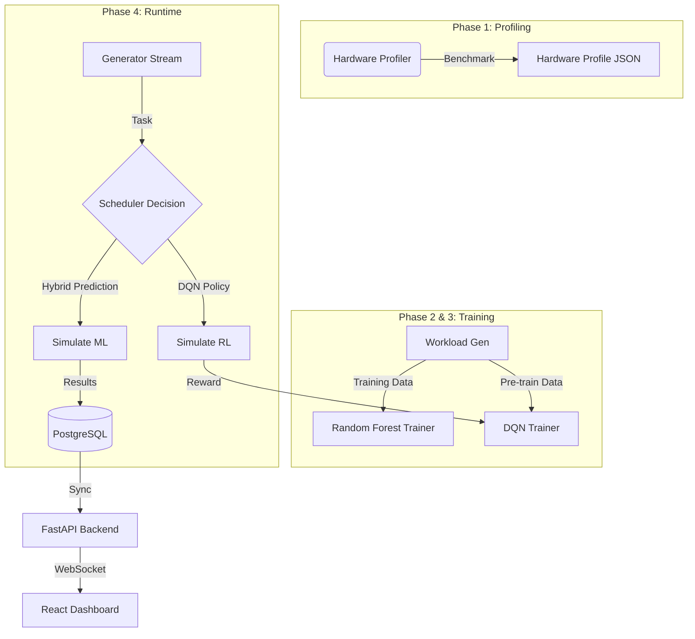

# 01. Architecture

This document describes the high-level architecture of the Hybrid ML Scheduler.

## Overall Pipeline Diagram

## Core Components

1. **Simulation Engine (`src/simulation_engine.py`)** 
   The core loop driving the entire system. It generates tasks, distributes them to all 6 schedulers (Round Robin, Random, Greedy, Hybrid ML, RL Agent, Oracle), computes metrics, handles ML retraining, and broadcasts results.

2. **FastAPI Backend (`backend/` & `src/dashboard_server_v2.py`)**
   Serves as the bridge between the backend physics engine and the front-end dashboard using asynchronous WebSockets. Currently migrating towards a robust Service/Repository pattern inside the `backend/` module.

3. **React Dashboard (`dashboard/src/App.jsx`)**
   The single-page application (SPA) providing real-time visibility. It features widget-based visualizations for global comparisons, real-time load, radar charts, and ML decision auditing.

4. **Schedulers**
   * **Hybrid ML (`src/online_scheduler.py` & `src/ml_models.py`)**: Uses a Scikit-Learn `RandomForestRegressor` to predict optimal GPU fractions based on task physics.
   * **RL Agent (`src/dqn_scheduler.py`)**: Uses PyTorch (DQN) with a 256-neuron architecture to map state (Size, Intensity, Memory) to CPU/GPU assignments, optimizing for makespan and energy.

5. **Workload Generator (`src/workload_generator.py`)**
   Generates a synthetic task stream mimicking a Log-Normal or Pareto distribution common in High-Performance Computing (HPC) clusters.
